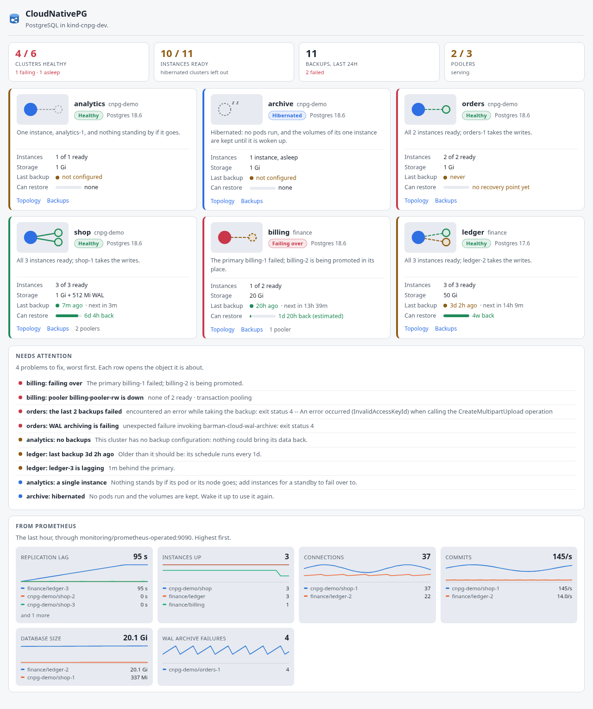
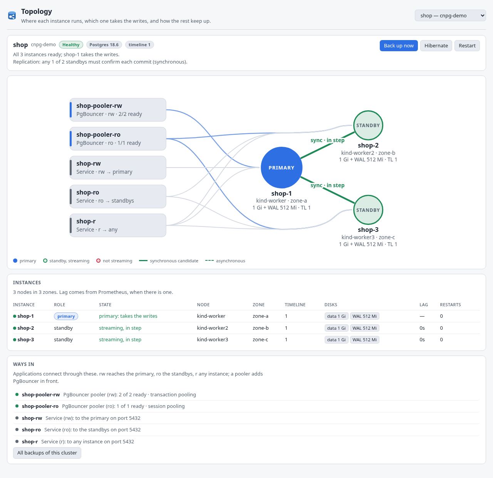
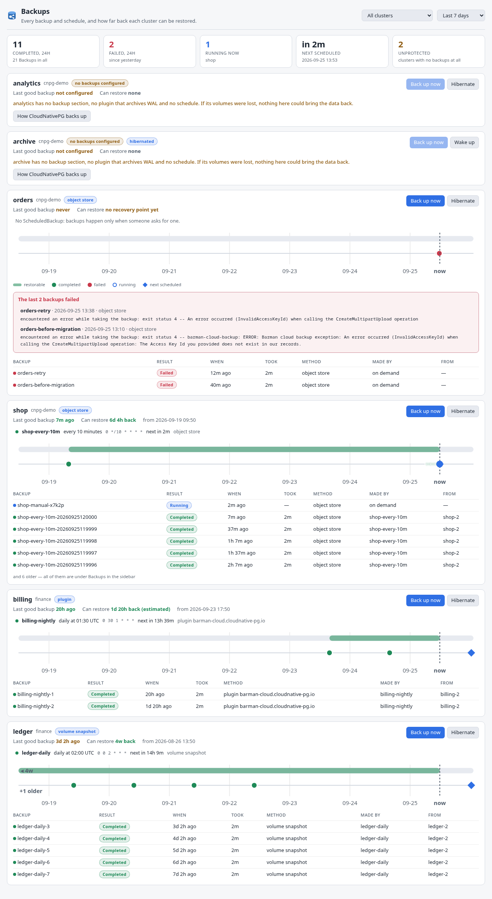

# CloudNativePG for K8s Dockside

A [K8s Dockside](https://github.com/k8sdockside/k8sdockside) plugin for
[CloudNativePG](https://cloudnative-pg.io), the operator that runs PostgreSQL
in Kubernetes: one primary taking the writes, standbys streaming from it,
failover when the primary goes, PgBouncer poolers in front, and backups to an
object store, to volume snapshots or through a plugin.

It answers the questions you open Postgres for — is every cluster up, is every
standby keeping up, and could each one be restored, and to when — without
`kubectl cnpg status` and without reading a status block.

<!-- markdownlint-disable-next-line MD033 -->




## What it shows

**Dashboard** — one card per Postgres cluster: its state in plain words
("Healthy", "Switching primary", "Failing over", "Hibernated", "2 of 3 ready"),
its shape as a small picture (the primary as a filled circle, each standby as
a ring that is green when streaming, amber when lagging and red when not
streaming, solid links for synchronous candidates and dashed for async), the
Postgres version, the storage it asks for, how old its last good backup is —
coloured against its own schedule — and how far back a point-in-time recovery
can reach. A card's edge takes the worst of the cluster and its backups: a
database that is up but could not be restored is not fine.

Under the cards, everything that needs a person, worst first, each row
opening the object it is about: failing clusters and failovers, a primary or
a standby that is not ready, standbys lagging, failed backups with the
backup tool's own error, failing WAL archiving, stale backups, clusters with
no backups, poolers with no ready pod, schedules the operator cannot read,
instances sharing a node, and — as information — single instances and
hibernated clusters. Then the exporter's numbers from Prometheus, when there
is one.

**Topology** — one cluster drawn whole: the primary in the middle, its
standbys on an arc around it, and down the left every way in — the Poolers
and the `-rw`, `-ro` and `-r` Services — wired to the instances they reach.
Each link says whether it is a synchronous candidate or async and, with
Prometheus, how far behind the standby is. Each instance shows its node, zone,
disks and timeline; a failover draws the old primary red and the standby being
promoted with a halo. Under the map, the same instances as a table. Clicking
anything opens it in the app.



**Backups** — a section per cluster: the methods it backs up with, its
ScheduledBackups in words ("every 10 minutes", "daily at 02:00 UTC") with the
next run, and a timeline of the last day, week or month with the recovery
window as a band, every Backup as a dot and the next run as a diamond. Failures
since the last success are written out in full, as the tool wrote them. A
cluster with no backups at all gets a section that says so.



**Panels** on Clusters (state, shape, primary and standbys, last backup,
recovery window, poolers, and the buttons), on Pods (primary or standby, of
which cluster, streaming or not, disks — and one line saying so on a pod
CloudNativePG did not make) and on PersistentVolumeClaims (data, WAL or
tablespace, of which instance, whether that is the primary, and whether the
operator lists the claim as healthy, dangling or resizing).

Every CloudNativePG kind also gets a table in the sidebar — Clusters, Backups,
ScheduledBackups, Poolers, Databases, Publications, Subscriptions and both
image catalogs — plus the instance pods, the pooler pods, the volumes and the
operator.

More screenshots, in both themes, are in [`docs/screenshots/`](docs/screenshots/).

## What it reads, and what it changes

It reads CloudNativePG's custom resources in `postgresql.cnpg.io/v1`, and
Pods, PersistentVolumeClaims and Services carrying the `cnpg.io/cluster`
label, and Nodes (for their zone). It never reads Secrets: the app refuses
that for every plugin, whatever a manifest says.

It can ask for four changes. Each is shown to you in a dialog the pages
cannot reach or answer, and happens only if you say yes:

| Action | On | What it writes |
| --- | --- | --- |
| Back up now | Cluster | creates a `Backup` named `<cluster>-manual-…` with `spec.cluster.name` and `spec.method`: `barmanObjectStore` for a cluster with `spec.backup.barmanObjectStore`, `volumeSnapshot` for one with `spec.backup.volumeSnapshot` (`<cluster>-snapshot-…` from the action bar), or `plugin` with `pluginConfiguration.name` set to the cluster's WAL-archiving plugin |
| Hibernate | Cluster | the annotation `cnpg.io/hibernation: "on"` |
| Wake up | Cluster | the annotation `cnpg.io/hibernation: "off"` |
| Restart | Cluster | the annotation `kubectl.kubernetes.io/restartedAt` set to the current time — what `kubectl cnpg restart` writes; the operator then restarts the instances one by one |

Back up now is not offered on a hibernated cluster, which the operator would
refuse. Hibernate and Wake up are on every Cluster's action bar: the manifest's
conditions can only read field paths without dots, so they cannot tell the
annotation apart, and the plugin's own pages show only the one that applies.
Restart is on the Topology view and the Cluster panel only, because its value
is a timestamp and a manifest action can only write fixed values.

**Switchover is deliberately not offered.** `kubectl cnpg promote` works by
writing the Cluster's *status* (`targetPrimary`), through the status
subresource; a merge patch of the object, which is all a plugin can ask for,
cannot do it.

### Charts

Six overview charts from the CloudNativePG exporter, when a Prometheus
scrapes it (a `PodMonitor` per cluster, as the CloudNativePG monitoring guide
describes): replication lag, instances up, connections, commits per second,
database size and WAL archive failures — all from metrics the exporter
publishes by default (`cnpg_pg_replication_lag`, `cnpg_collector_up`,
`cnpg_backends_total`, `cnpg_pg_stat_database_xact_commit`,
`cnpg_pg_database_size_bytes`, `cnpg_pg_stat_archiver_failed_count`). The
Topology view puts each standby's latest lag on its link. Every Cluster also
gets two charts of its own in its detail view: lag and connections per
instance. Without a Prometheus the Dashboard says so, and nothing else changes.

### What it does not know

Which standbys are synchronous *right now* is not in the Kubernetes API: the
spec says how many should be and how they are chosen, and Postgres decides
which. The plugin draws every standby as a synchronous *candidate* when the
cluster asks for synchronous replication, and says the rule in words ("any 1
of 2 standbys must confirm each commit"). Replication lag, likewise, is only
known through Prometheus.

The Cluster's `lastSuccessfulBackup` and `firstRecoverabilityPoint` are not set
when a backup plugin does the backups; the plugin then reads them off the
Backup objects and marks the recovery window as estimated.

## Installing

In K8s Dockside: **Settings → Plugins → From a repository**:

```text
https://github.com/k8sdockside/cnpg.git
```

Needs K8s Dockside 0.1.12 or newer.

## Trying it

[`dev/`](dev/README.md) has a script that makes a kind cluster with the
CloudNativePG operator and four Postgres clusters — healthy with poolers and
scheduled backups, a single instance with no backups, backups failing on bad
credentials, and hibernated — so every state has something real behind it:

```sh
dev/up.sh
dev/down.sh
```

## Working on it

The pages are TypeScript in `src/`, bundled into `ui/` — which is what the app
serves, and what installing clones, so `ui/` is committed and must be in step
with `src/`.

```sh
npm install
npm run build     # src/ -> ui/
npm run watch     # rebuild on every change; reopen the tab to see it
npm run preview   # draw every page to preview/, with no cluster
npm run check     # typecheck, unit tests, and ui/ against a fresh build
```

`npm run preview` is the one to reach for first. It runs every page against
the fixtures in `src/fixtures.ts` — the four dev clusters, plus a standby 95
seconds behind and a cluster failing over with its pooler down — and writes
them to `preview/` as standalone HTML in both the app's light and dark themes.
It reads the themes from a K8s Dockside checkout beside this one
(`../k8sdockside`, or `K8SDOCKSIDE=`). Open `preview/index.html`. The buttons
in a preview do nothing: there is no app behind them.

To see your changes in the app without installing anything: **Settings →
Plugins → Watch another folder**, point it at this checkout, and press
**Reload** after each build.

To check the manifest the way the app does:

```sh
go run github.com/k8sdockside/k8sdockside/cmd/plugincheck@v0.1.12 .
```

### How it is laid out

| | |
| --- | --- |
| `plugin.json` | the manifest: views, cards, charts, panels, actions |
| `src/model/` | what CloudNativePG's resources mean — state, topology, backups, schedules, the attention list — with the tests |
| `src/ui/` | the pieces the pages are drawn from: the glyph and the map, the timeline, tiles, the buttons |
| `src/pages/` | one `.ts` and one `.html` per page, plus `render.test.ts` |
| `src/styles/` | one stylesheet, written in the app's theme tokens |
| `dev/` | the kind cluster and the samples |

Everything with CloudNativePG knowledge in it lives in `src/model/` and is
tested without a cluster: that every phase the operator writes has words and a
tone, that a "healthy" phase with a missing standby is not called healthy,
that hibernation is read from the annotation and its condition rather than the
phase, that a ScheduledBackup's schedule has six fields with seconds first (so
a CronJob-style `0 2 * * *` runs every hour, as the operator would run it),
that staleness is measured against the cluster's own schedule, that failures
are only news until a later backup works, and that a job pod is not drawn as
an instance.

The field names in `src/model/cnpg.ts` are the JSON tags from CloudNativePG's
`api/v1/*_types.go`, and the labels and annotations are the constants in
`pkg/utils/labels_annotations.go`, both checked against v1.30.1. The cron
parser follows robfig/cron v1.2.0, the library the operator uses.

## Credit

[CloudNativePG](https://cloudnative-pg.io) is a
[CNCF](https://www.cncf.io) project and PostgreSQL is a trademark of the
PostgreSQL Community Association. Their names are used here only to say what
this plugin is for. The mark it ships is CloudNativePG's own, unchanged
except for a viewBox that frames the elephant without the wordmark under it;
`src/assets/logo.svg` names its source. This plugin is not affiliated with
either project.

Apache 2.0 — see [LICENSE](LICENSE).
